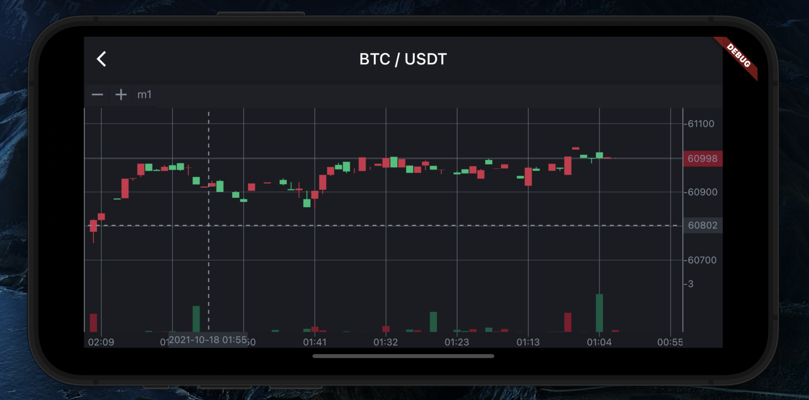
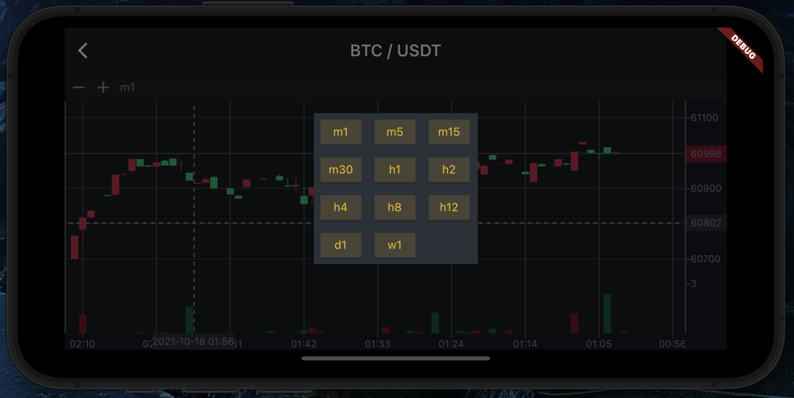
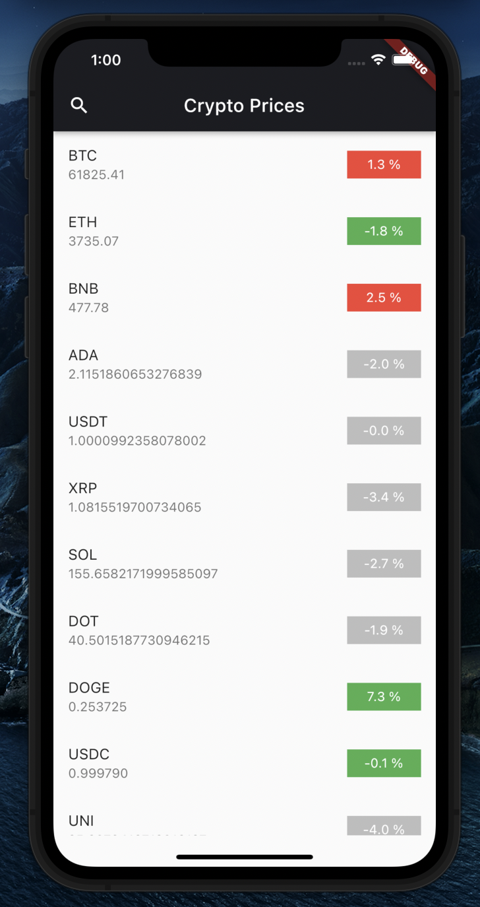

# Crypto Prices

&nbsp; &nbsp; &nbsp;

<pre>
   
</pre>
  

### EN Version
CryptoPrices is a simple sample application that displays an updated price list of cryptocurrency digital assets, from Bitcoin, Ethereum, Binance, Doge and others. As well as displaying a candle stick chart of the desired time interval.

### Apps Feature:

- Real Time Price Assets
- Real Time Gain / Loss Asset 
- Real Time Candle Stick Chart

   ### Information
   You can read the postman collection from CoinCap below to explore more  <a href="https://docs.coincap.io/#89deffa0-ab03-4e0a-8d92-637a857d2c91">CoinCap Collection</a>

### ID Version
CryptoPrices adalah sebuah aplikasi sederhana yang menampilkan daftar harga terupdate asset digital cryptocurrency,dari mulai Bitcoin, Ethereum, Binance, Doge dan lainnya. Serta menampilkan candle stick chart dari interval waktu yang diinginkan.

### Apps Feature:

- Real Time Price Assets
- Real Time Gain / Loss Asset 
- Real Time Candle Stick Chart
 

  ### Information
  Anda bisa membaca dokumentasi dari collection postman CoinCap berikut untuk mengcustom / mengeksplorasi <a href="https://docs.coincap.io/#89deffa0-ab03-4e0a-8d92-637a857d2c91">CoinCap Collection</a>
